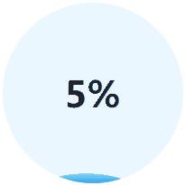

# loading-ball
Using html, css, and js to implement an animation in load (the flowing water continues to flow and rise)

[中文文档](doc/README.zh-CN.md)

effect:

+ Manually controllable progress
+ Animation effect and smooth switching between animations
+ Text is displayed in another color after being covered by the foreground
+ Minimize the use of js