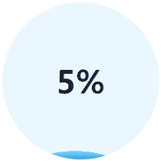

# loading-ball
使用html,css,js实现一个加载中的动画(流动的水在持续流动且上升)

效果:



+ 可手动控制进度
+ 有动画效果且动画间切换流畅
+ 文字被前景覆盖后显示为另一种颜色
+ 尽可能少使用js

## 如何使用
```javascript
import { LoadingBall } from "./LoadingBall.js";

// 默认会选择document.body作为目标
const ball1 = new LoadingBall();

// 选择ID为app的作为目标
const ball2 = new LoadingBall({
    target:document.querySelector("#app")
});

// 其他配置项
const ball3 = new LoadingBall({
    target:document.querySelector(".target")
    width: 100, // 1到100，必须是整数
    fontSize: 20, // 正数数字
    // #FFFEEE 或 rgb(...) 或 rgba(...)
    backgroundColor: "#eaf7ff", 
    backgroundTextColor: "#1f232c",
    foregroundTextColor: "#ffffff",
});
// 更多定制效果需要手动修改LoadingBall.css

ball1.to(5); // 进度变化到5%
ball2.to(50); // 进度变化到50%
ball3.to(100); // 进度变化到100%
```

需要把LoadingBall.css加入你的html文档中
```html
<link rel="stylesheet" href="LoadingBall.css">
```